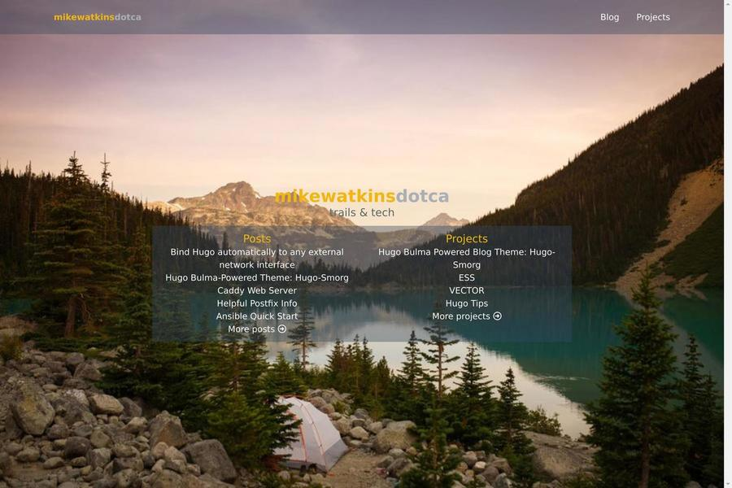

# hugo-smorg

Hugo-smorg is a mobile-first / responsive Bulma-powered theme for the [Hugo](https://gohugo.io/) static site generator. 

The theme is under on-going development and is being used as a base theme for
a number of other projects. This theme will keep pace with Hugo features as
Hugo evolves.

Project page: [github.com/solutionroute/hugo-smorg project](https://github.com/solutionroute/hugo-smorg) 

[Demo Site](https://solutionroute.github.io/demo/hugo-smorg/)

## Screenshots

**Desktop - Landing Page**  

**Desktop - Authors Landing Page** 

A few lines of CSS and one tweak to a single template:

