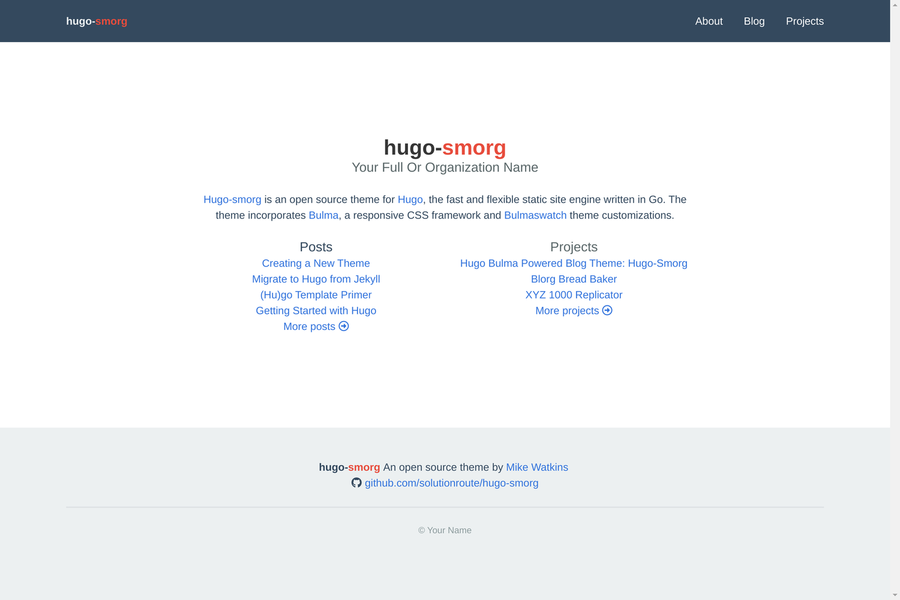

# hugo-smorg

Project page: [github.com/solutionroute/hugo-smorg project](https://github.com/solutionroute/hugo-smorg) 

March 2018: Responsive, minimalistic [Hugo](https://gohugo.io/) static site generator theme suitable for an individual or small organization.

## Screenshots

### Desktop

*Desktop - Blog (Post) Single Page*

*Desktop - Blog (Post) summaries*

### Touch

*Mobile  - Landing page*

*Mobile - Navigation menu active* 

*Mobile - Blog (Post) summaries*

